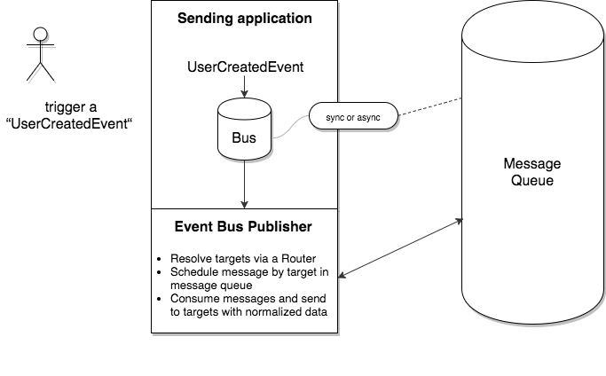

# WakeOnWeb EventBusPublisher

## Installation

This repository is currently private, so you have to add it to your repositories:

`composer.json`

```
    "repositories": [
        {
            "type": "vcs",
            "url":  "git@bitbucket.org:wakeonweb/event-bus-publisher.git"
        }
    ],
```

`composer.json`

```
    "wakeonweb/event-bus-publisher": "^1.0@dev"
```

If you use **Symfony**, you can load the bundle `WakeOnWeb\EventBusPublisher\App\Bundle\WakeonwebEventBusPublisherBundle`.

## Usage

### Synchronous

```
wakeonweb_event_bus_publisher:
    publishing:
        listened_prooph_buses: [sync_external_outgoing_event_bus]
        delivery_mode: synchronous
    driver:
        # ... see driver chapter
```

Define the prooph buses this publisher will listen to.
Once an event is dispatched in theses buses, it'll dispatch events to targets.

### Asynchronous

```
wakeonweb_event_bus_publisher:
    publishing:
        listened_prooph_buses: [sync_external_outgoing_event_bus]
        delivery_mode: asynchronous
        queue_name: my_queue_name.{target}
    driver:
        # ... see driver chapter
```

Define the prooph buses this publisher will listen to.
Once an event is dispatched in theses buses, it'll guess route then dispatch this event
in a dedicated queue called `my_queue_name.{target}` where {target} is the target name.

Then consume theses messages to dispatch them to targets:

```
./bin/console bernard:consume my_queue_name.target_x
```


## Flow



## Drivers implemented

- [Symfony configuration](docs/driver-symfony-configuration.md)
- [InMemory] TBD
- [DoctrineORM] @TODO

## Todo

- This library should itself trigger message in rabbit before route events ?
- Success strategy
- Failure strategy
